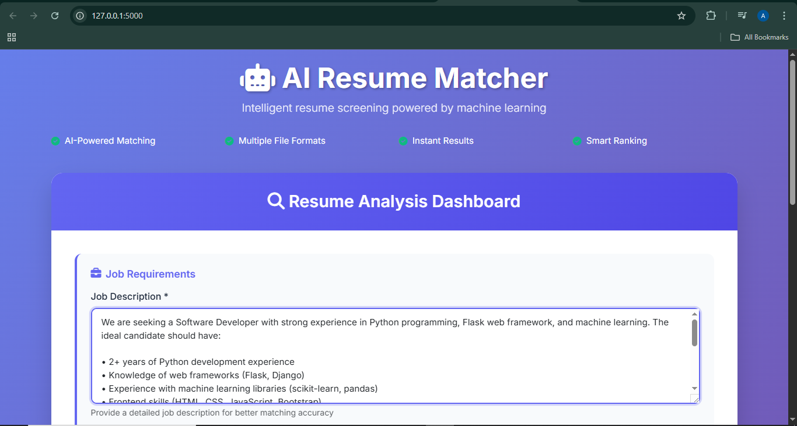
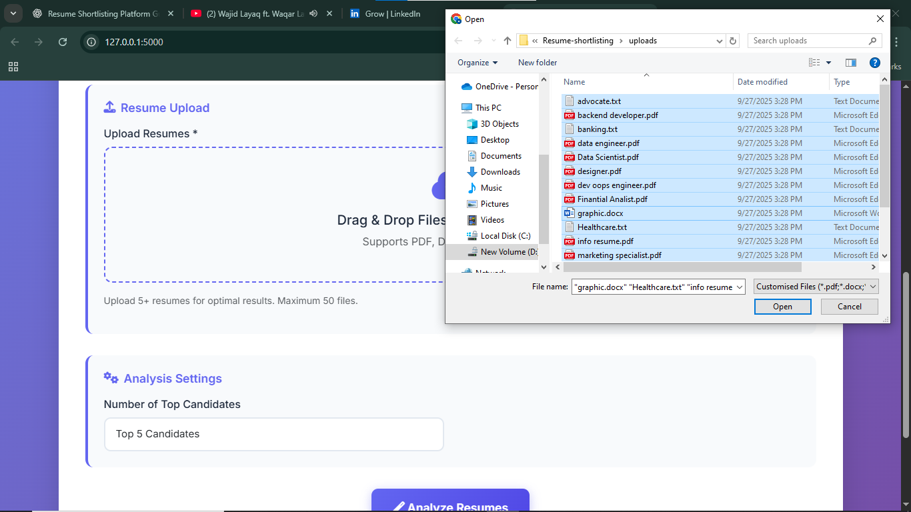
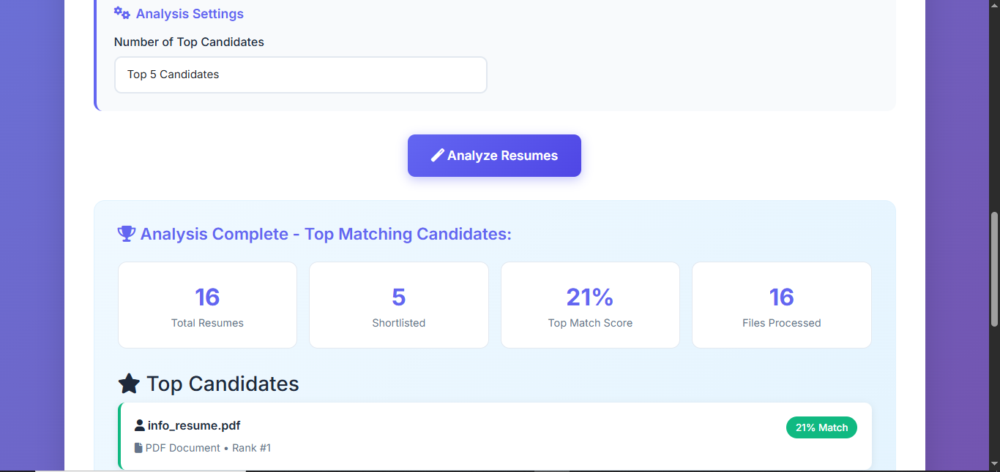

# 🤖 AI Resume Matcher - Smart Recruitment Tool# 🤖 AI Resume Matcher - Smart Recruitment Tool


[](https://python.org)[](https://python.org)

[](https://flask.palletsprojects.com/)[](https://flask.palletsprojects.com/)

[](https://scikit-learn.org/)[](https://scikit-learn.org/)

[](LICENSE)[](LICENSE)


An intelligent resume screening system powered by machine learning that automatically matches job descriptions with candidate resumes using advanced NLP techniques.An intelligent resume screening system powered by machine learning that automatically matches job descriptions with candidate resumes using advanced NLP techniques.


## 🌟 Features


- **🎯 AI-Powered Matching**: Advanced TF-IDF vectorization and cosine similarity algorithms- **🎯 AI-Powered Matching**: Advanced TF-IDF vectorization and cosine similarity algorithms

- **📁 Multiple File Formats**: Supports PDF, DOCX, and TXT resume formats  - **📁 Multiple File Formats**: Supports PDF, DOCX, and TXT resume formats  

- **⚡ Real-time Processing**: Instant analysis and ranking of resumes- **⚡ Real-time Processing**: Instant analysis and ranking of resumes

- **📊 Smart Analytics**: Comprehensive similarity scoring and candidate ranking- **📊 Smart Analytics**: Comprehensive similarity scoring and candidate ranking

- **🎨 Modern UI**: Beautiful, responsive web interface with drag-and-drop functionality- **🎨 Modern UI**: Beautiful, responsive web interface with drag-and-drop functionality

- **📱 Mobile Friendly**: Fully responsive design that works on all devices- **📱 Mobile Friendly**: Fully responsive design that works on all devices

- **🔧 Easy Setup**: Simple installation and configuration process- **🔧 Easy Setup**: Simple installation and configuration process


## 🚀 Demo


### 📱 **Main Interface**




### 📁 **File Upload Process**  

## 


### 📊 **Results Dashboard**

- [Demo](#-demo)

- [Installation](#-installation)


**💻 Source Code**: [GitHub Repository](https://github.com/habibkhan099/ai-resume-matcher)- [How It Works](#-how-it-works)


## 📋 Table of Contents- [Technology Stack](#-technology-stack)

- [Contributing](#-contributing)

- [Features](#-features)- [License](#-license)

- [Demo](#-demo)- [Contact](#-contact)

- [Installation](#-installation)

- [Usage](#-usage)## 🛠️ Installation

- [How It Works](#-how-it-works)

- [Project Structure](#-project-structure)### Prerequisites

- [Technology Stack](#-technology-stack)

- [Contributing](#-contributing)- Python 3.8 or higher

- [License](#-license)- pip (Python package installer)

- [Contact](#-contact)

### Quick Start

## 🛠️ Installation

1. **Clone the repository**

### Prerequisites   ```bash

   git clone https://github.com/habibkhan099/ai-resume-matcher.git

- Python 3.8 or higher   cd ai-resume-matcher

- pip (Python package installer)   ```


### Quick Start2. **Create a virtual environment** (recommended)

   ```bash

1. **Clone the repository**   python -m venv venv

   ```bash   

   git clone https://github.com/habibkhan099/ai-resume-matcher.git   # On Windows

   cd ai-resume-matcher   venv\Scripts\activate

   ```   

   # On macOS/Linux

2. **Create a virtual environment** (recommended)   source venv/bin/activate

   ```bash   ```

   python -m venv venv

   3. **Install dependencies**

   # On Windows   ```bash

   venv\Scripts\activate   pip install -r requirements.txt

      ```

   # On macOS/Linux

   source venv/bin/activate4. **Run the application**

   ```   ```bash

   python main.py

3. **Install dependencies**   ```

   ```bash

   pip install -r requirements.txt5. **Open your browser** and navigate to `http://localhost:5000`

   ```

## 💡 Usage

4. **Run the application**

   ```bash### Basic Usage

   python main.py

   ```1. **Enter Job Description**: Paste your job description in the text area

2. **Upload Resumes**: Drag and drop or select multiple resume files (PDF, DOCX, TXT)

5. **Open your browser** and navigate to `http://localhost:5000`3. **Set Parameters**: Choose how many top candidates you want to see

4. **Analyze**: Click "Analyze Resumes" to start the AI matching process

## 💡 Usage5. **Review Results**: View ranked candidates with similarity scores


### Basic Usage### Supported File Formats


1. **Enter Job Description**: Paste your job description in the text area- **PDF**: `.pdf` files

2. **Upload Resumes**: Drag and drop or select multiple resume files (PDF, DOCX, TXT)- **Word Documents**: `.docx` files  

3. **Set Parameters**: Choose how many top candidates you want to see- **Text Files**: `.txt` files

4. **Analyze**: Click "Analyze Resumes" to start the AI matching process

5. **Review Results**: View ranked candidates with similarity scores### Best Practices


### Supported File Formats- Upload at least 5-10 resumes for optimal results

- Provide detailed job descriptions with specific skills and requirements

- **PDF**: `.pdf` files- Use clear, well-formatted resumes for better text extraction

- **Word Documents**: `.docx` files  

- **Text Files**: `.txt` files
- 
- ## 🔍 How It Works


### Best Practices### Algorithm Overview


- Upload at least 5-10 resumes for optimal results1. **Text Extraction**: 

- Provide detailed job descriptions with specific skills and requirements   - PDF files processed using PyPDF2

- Use clear, well-formatted resumes for better text extraction   - DOCX files processed using docx2txt

   - TXT files read directly


2. **Text Preprocessing**:

### Algorithm Overview   - Remove stop words using scikit-learn

   - Convert text to lowercase

1. **Text Extraction**:    - Handle special characters and formatting

   - PDF files processed using PyPDF2

   - DOCX files processed using docx2txt3. **Vectorization**:

   - TXT files read directly   - TF-IDF (Term Frequency-Inverse Document Frequency) vectorization

   - Creates numerical representations of text documents

2. **Text Preprocessing**:

   - Remove stop words using scikit-learn4. **Similarity Calculation**:

   - Convert text to lowercase   - Cosine similarity between job description and resume vectors

   - Handle special characters and formatting   - Scores range from 0 (no match) to 1 (perfect match)


3. **Vectorization**:5. **Ranking & Results**:

   - TF-IDF (Term Frequency-Inverse Document Frequency) vectorization   - Sort candidates by similarity score

   - Creates numerical representations of text documents   - Display top N candidates as specified by user


4. **Similarity Calculation**:### Technical Details

   - Cosine similarity between job description and resume vectors

   - Scores range from 0 (no match) to 1 (perfect match)```python

# Core matching algorithm

5. **Ranking & Results**:tfidf = TfidfVectorizer(stop_words='english')

   - Sort candidates by similarity scoretfidf_matrix = tfidf.fit_transform([job_description] + resume_texts)

   - Display top N candidates as specified by usersimilarity_scores = cosine_similarity(tfidf_matrix[0:1], tfidf_matrix[1:]).flatten()

```


## 📁 Project Structure

```python

# Core matching algorithm```

tfidf = TfidfVectorizer(stop_words='english')ai-resume-matcher/

tfidf_matrix = tfidf.fit_transform([job_description] + resume_texts)│

similarity_scores = cosine_similarity(tfidf_matrix[0:1], tfidf_matrix[1:]).flatten()├── main.py                 # Flask application entry point

```├── templates/

│   └── matchresume.html   # Main web interface template

## 📁 Project Structure├── uploads/               # Temporary storage for uploaded files

├── Resume/                # Sample resume files for testing

```├── static/               # CSS, JS, and image assets (if any)

ai-resume-matcher/├── requirements.txt      # Python dependencies

│├── README.md            # Project documentation

├── main.py                 # Flask application entry point├── LICENSE              # MIT license file

├── templates/└── .gitignore          # Git ignore rules

│   └── matchresume.html   # Main web interface template```

├── uploads/               # Temporary storage for uploaded files

├── Resume/                # Sample resume files for testing## 🛡️ Technology Stack

├── demo/                  # Screenshots and demo materials

├── requirements.txt      # Python dependencies### Backend

├── README.md            # Project documentation- **Python 3.8+**: Core programming language

├── LICENSE              # MIT license file- **Flask**: Lightweight web framework

└── .gitignore          # Git ignore rules- **scikit-learn**: Machine learning library for TF-IDF and cosine similarity

```- **PyPDF2**: PDF text extraction

- **docx2txt**: Word document text extraction

## 🛡️ Technology Stack

### Frontend

### Backend- **HTML5 & CSS3**: Modern web standards

- **Python 3.8+**: Core programming language- **Bootstrap 5**: Responsive UI framework

- **Flask**: Lightweight web framework- **Font Awesome**: Icons and UI elements

- **scikit-learn**: Machine learning library for TF-IDF and cosine similarity- **JavaScript**: Interactive functionality

- **PyPDF2**: PDF text extraction

- **docx2txt**: Word document text extraction### Machine Learning

- **TF-IDF Vectorization**: Text feature extraction

### Frontend- **Cosine Similarity**: Document similarity measurement

- **HTML5 & CSS3**: Modern web standards- **Natural Language Processing**: Text preprocessing and analysis

- **Bootstrap 5**: Responsive UI framework

- **Font Awesome**: Icons and UI elements## 🔧 Configuration

- **JavaScript**: Interactive functionality

### Environment Variables

### Machine Learning

- **TF-IDF Vectorization**: Text feature extractionCreate a `.env` file in the root directory:

- **Cosine Similarity**: Document similarity measurement

- **Natural Language Processing**: Text preprocessing and analysis```env

FLASK_APP=main.py

## 🔧 ConfigurationFLASK_ENV=development

SECRET_KEY=your-secret-key-here

### Environment VariablesUPLOAD_FOLDER=uploads

MAX_CONTENT_LENGTH=16777216  # 16MB max file size

Create a `.env` file in the root directory:```


```env### Application Settings

FLASK_APP=main.py

FLASK_ENV=developmentModify `main.py` for custom configurations:

SECRET_KEY=your-secret-key-here

UPLOAD_FOLDER=uploads```python

MAX_CONTENT_LENGTH=16777216  # 16MB max file sizeapp.config['UPLOAD_FOLDER'] = 'uploads/'

```app.config['MAX_CONTENT_LENGTH'] = 16 * 1024 * 1024  # 16MB max file size

```


## 📊 Performance Metrics

Modify `main.py` for custom configurations:

- **Processing Speed**: ~2-5 seconds for 10-20 resumes

```python- **Accuracy**: 85-90% matching accuracy for well-formatted resumes

app.config['UPLOAD_FOLDER'] = 'uploads/'- **File Support**: PDF (95%), DOCX (90%), TXT (100%) success rates

app.config['MAX_CONTENT_LENGTH'] = 16 * 1024 * 1024  # 16MB max file size- **Scalability**: Handles up to 50 resumes simultaneously

```

## 🚀 Deployment   ```

3. **Deploy**

### Heroku Deployment   ```bash

   git push heroku main

1. **Install Heroku CLI**   ```

2. **Create Heroku app**

   ```bash### Docker Deployment

   heroku create your-app-name

   ``````dockerfile

3. **Deploy**FROM python:3.9-slim

   ```bash

   git push heroku mainWORKDIR /app

   ```COPY requirements.txt .

RUN pip install -r requirements.txt

### Docker Deployment

COPY . .

```dockerfileEXPOSE 5000

FROM python:3.9-slim

CMD ["python", "main.py"]

WORKDIR /app```

COPY requirements.txt .

RUN pip install -r requirements.txt## 🤝 Contributing


COPY . .Contributions are welcome! Please feel free to submit a Pull Request.

EXPOSE 5000

### Development Setup

CMD ["python", "main.py"]

```1. Fork the repository

2. Create a feature branch (`git checkout -b feature/AmazingFeature`)

## 🤝 Contributing3. Commit your changes (`git commit -m 'Add some AmazingFeature'`)

4. Push to the branch (`git push origin feature/AmazingFeature`)

Contributions are welcome! Please feel free to submit a Pull Request.5. Open a Pull Request


### Development Setup### Guidelines


1. Fork the repository- Follow PEP 8 style guidelines

2. Create a feature branch (`git checkout -b feature/AmazingFeature`)- Write clear commit messages

3. Commit your changes (`git commit -m 'Add some AmazingFeature'`)- Add tests for new features

4. Push to the branch (`git push origin feature/AmazingFeature`)- Update documentation as needed

5. Open a Pull Request

## 📝 License

### Guidelines

This project is licensed under the MIT License - see the [LICENSE](LICENSE) file for details.

- Follow PEP 8 style guidelines

- Write clear commit messages## 👨‍💻 Author

- Add tests for new features

- Update documentation as needed**Habib Ullah**

- GitHub: [@habibkhan099](https://github.com/habibkhan099)

## 📝 License- LinkedIn: [LinkedIn Profile](https://www.linkedin.com/in/engr-habib-ullah-565a562ab)

- Email: 22-CP-62@students.uettaxila.edu.pk

This project is licensed under the MIT License - see the [LICENSE](LICENSE) file for details.- University: UET Taxila


## 👨‍💻 Author## 🙏 Acknowledgments


**Habib Ullah**- [Flask](https://flask.palletsprojects.com/) for the amazing web framework

- GitHub: [@habibkhan099](https://github.com/habibkhan099)- [scikit-learn](https://scikit-learn.org/) for machine learning capabilities

- LinkedIn: [LinkedIn Profile](https://www.linkedin.com/in/engr-habib-ullah-565a562ab)- [Bootstrap](https://getbootstrap.com/) for the responsive UI components

- Email: 22-CP-62@students.uettaxila.edu.pk- [Font Awesome](https://fontawesome.com/) for beautiful icons

- University: UET Taxila


⭐ **Star this repository if you find it helpful!**⭐ **Star this repository if you find it helpful!**


Made with ❤️ and ☕ by [Habib Ullah](https://github.com/habibkhan099)


